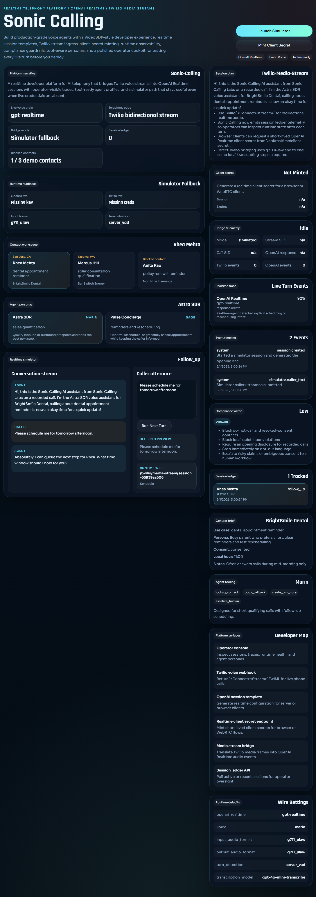

# Sonic Calling

A developer-first realtime voice platform for building AI phone agents with **OpenAI Realtime** and **Twilio telephony**.

Sonic Calling is intentionally shaped more like a **VideoSDK-style developer platform** than a one-off bot demo. The repo now includes:

- a richer operator cockpit
- a session ledger API
- OpenAI Realtime session templating aligned to current audio formats
- Twilio bidirectional Media Streams wiring
- realtime client-secret minting
- live bridge telemetry and event timelines
- compliance guardrails
- simulator and smoke-tested local workflow

## What is included

- **Realtime voice runtime:** OpenAI Realtime session templates with tool declarations, transcription settings, turn detection, noise reduction, audio format controls, and output voice tuning
- **Telephony edge:** Twilio `<Connect><Stream>` webhook responses plus a media-stream bridge that can forward `g711_ulaw` audio directly to OpenAI Realtime
- **Operator cockpit:** React dashboard for contact selection, agent personas, session planning, runtime readiness, event timeline inspection, bridge telemetry, and simulator turns
- **Session ledger:** API and UI surfaces for reviewing tracked sessions, stream state, event counts, transcripts, and last tool activity
- **Browser-client path:** Realtime client-secret endpoint for browser or WebRTC-style flows using short-lived credentials
- **Compliance layer:** quiet-hours gating, DNC/revoked-consent blocking, disclosure checks, opt-out handling, and risky-claim detection

## Repo structure

```text
apps/
|-- api/
|   |-- app/
|   |   |-- services/
|   |   |   |-- compliance.py
|   |   |   |-- openai_transport.py
|   |   |   |-- realtime.py
|   |   |   |-- realtime_bridge.py
|   |   |   |-- store.py
|   |   |   `-- twilio_adapter.py
|   |   |-- config.py
|   |   |-- data.py
|   |   |-- main.py
|   |   `-- schemas.py
|   `-- requirements.txt
`-- web/
    `-- src/
        |-- App.tsx
        |-- index.css
        `-- main.tsx
docs/
|-- architecture.md
`-- audit.md
tests/
|-- test_api.py
|-- test_bridge.py
|-- test_realtime.py
|-- web_smoke.py
`-- artifacts/
```

## Core capabilities

### 1. Realtime session planning

`POST /api/session-plan`

Returns:

- selected contact
- selected agent profile
- compliance evaluation
- disclosure-aware opening line
- Twilio websocket path
- realtime model guidance notes

### 2. Session ledger

- `POST /api/sessions`
- `GET /api/sessions`
- `GET /api/sessions/{session_id}`
- `POST /api/sessions/{session_id}/respond`

The ledger tracks:

- conversation turns
- state transitions
- runtime mode and bridge status
- Twilio/OpenAI event counts
- stream/call identifiers
- last transcripts
- last tool activity
- event timeline

### 3. Realtime browser credentialing

`POST /api/realtime/client-secret`

When `OPENAI_API_KEY` is configured, Sonic Calling can mint a short-lived OpenAI Realtime client secret for browser-side or WebRTC-connected clients. When the key is absent, the same endpoint returns a structured preview response so local development still works cleanly.

### 4. Twilio live-call entry

`POST /twilio/voice/{session_id}`

Returns TwiML that:

- speaks the opening disclosure line
- starts a bidirectional `<Connect><Stream>`
- passes `session_id`, `agent_name`, and platform metadata as stream parameters

### 5. Live bridge behavior

`/twilio/media-stream/{session_id}` supports two modes:

- **Live mode:** if `OPENAI_API_KEY` is present, inbound Twilio audio is forwarded to OpenAI Realtime, and model output audio is streamed back to Twilio
- **Simulator mode:** if the key is missing, Sonic Calling still records normalized Twilio-style events and keeps the operator cockpit useful

## Current OpenAI/Twilio alignment

This repo was aligned against official documentation accessed on **May 1, 2026**:

- OpenAI Realtime:
  - [Realtime API overview](https://platform.openai.com/docs/guides/realtime/overview)
  - [Realtime WebSocket guide](https://platform.openai.com/docs/guides/realtime-websocket)
  - [Realtime API reference](https://developers.openai.com/api/reference/resources/realtime)
  - [GPT-4o mini Transcribe](https://developers.openai.com/api/docs/models/gpt-4o-mini-transcribe)
- Twilio Voice:
  - [Media Streams overview](https://www.twilio.com/docs/voice/media-streams)
  - [Media Streams WebSocket messages](https://www.twilio.com/docs/voice/media-streams/websocket-messages)
  - [TwiML `<Stream>` reference](https://www.twilio.com/docs/voice/twiml/stream)
- Product-shape inspiration:
  - [VideoSDK platform](https://www.videosdk.live/v1)

## Dashboard preview



## Quick start

### 1. Install

```bash
python -m pip install -r apps/api/requirements.txt
npm install
```

### 2. Configure

Copy `.env.example` into your environment or shell and set:

- `OPENAI_API_KEY` for live Realtime bridging and client-secret minting
- `TWILIO_ACCOUNT_SID`, `TWILIO_AUTH_TOKEN`, and `TWILIO_FROM_NUMBER` for deploy-time Twilio calling
- `PUBLIC_BASE_URL` and `PUBLIC_WEBSOCKET_BASE` to your public HTTPS/WSS host in deployed environments

### 3. Run locally

```bash
python -m uvicorn apps.api.app.main:app --port 8000
npm --workspace apps/web run dev -- --host 127.0.0.1 --port 5173
```

### 4. Verify

```bash
python -m pytest tests -q
npm run lint:web
npm run build:web
python -m playwright install chromium
python C:/Users/samee/.codex/skills/webapp-testing/scripts/with_server.py --server "python -m uvicorn apps.api.app.main:app --port 8000" --port 8000 --server "npm --workspace apps/web run dev -- --host 127.0.0.1 --port 5173" --port 5173 -- python tests/web_smoke.py
```

## Advanced implementation notes

- Twilio bidirectional streams use `audio/x-mulaw` at `8000Hz`; Sonic Calling configures `g711_ulaw` input and output for OpenAI Realtime so the bridge can avoid an extra local transcoding layer
- Server-side VAD is the default because phone calls benefit from idle timeout handling and more deterministic interruption behavior
- The simulator path intentionally remains first-class so teams can work on agent policy, UI, and workflow tooling before live credentials are available
- Event timelines are capped to the most recent entries so the in-memory session store stays lightweight

## Important scope note

This repo now goes well beyond a mock dashboard, but it still does **not** claim to fully certify:

- carrier delivery success
- regional calling-law compliance
- production Twilio routing behavior
- deploy-time WSS termination
- real account quotas or billing behavior on OpenAI/Twilio

Those remain environment-specific go-live tasks.

## License

MIT
